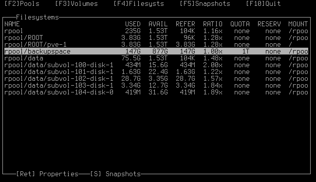
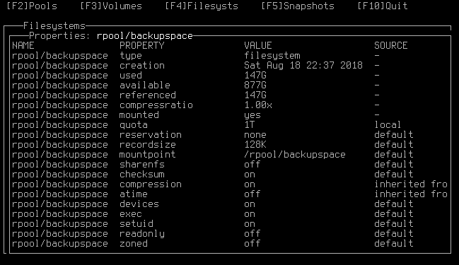

Note: this fork is pretty thrown together.

~~Get it with `nix-build https://github.com/deliciouslytyped/zfstui/tarball/master -A fork`~~

~~Try the original with `nix-build https://github.com/deliciouslytyped/zfstui/tarball/master -A upstream`~~

Since `-A` doesn't work with URLs for some reason, get it with `nix-build https://github.com/deliciouslytyped/zfstui/tarball/master`. One result symlink will be the fork, the other will be the upstream. 
The one with the capitalized column names is upstream.

# zfstui
Terminal user interface for the ZFS filesystem





## Installation

### From PyPI
```shell
> pip install zfstui
```

### From git
```shell
> git clone https://github.com/volkerp/zfstui.git
> cd zfstui
> python3 setup.py install
```

